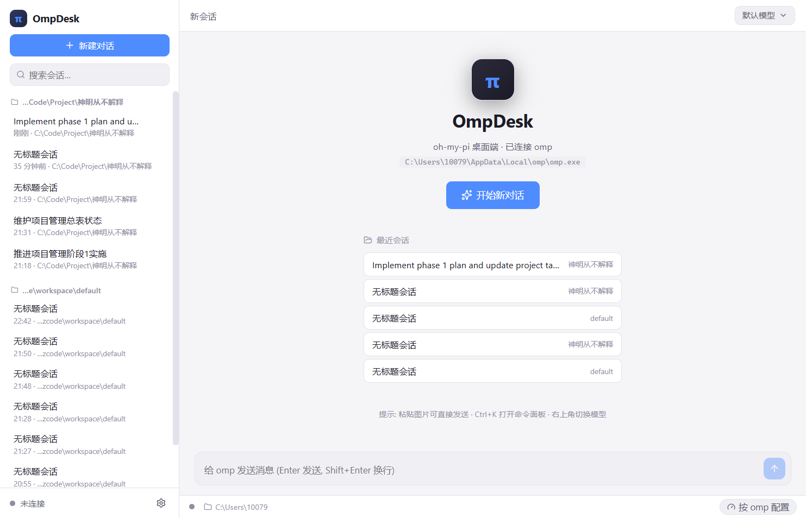
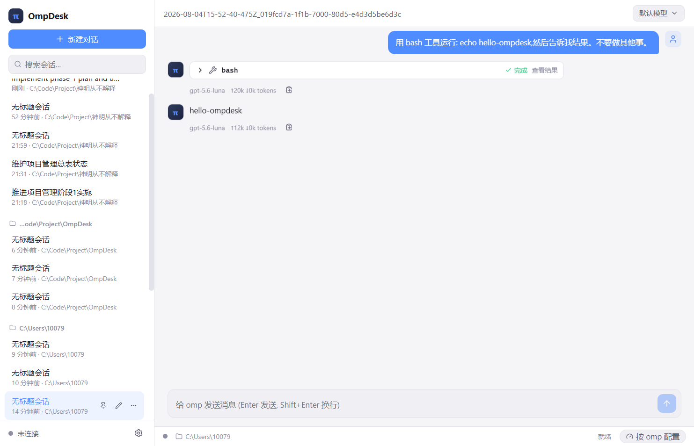

# OmpDesk — Desktop GUI for the oh-my-pi (omp) Terminal AI Coding Agent

**A Claude-Desktop-style home for the [oh-my-pi (omp)](https://omp.sh/) terminal AI coding agent.**

    

OmpDesk talks to the real `omp` CLI over its RPC interface (`omp --mode rpc-ui`) — no mocks, no wrappers around another GUI. It turns your terminal agent into a first-class desktop application: streaming chat with thinking blocks and tool-call cards, session history and resume, model & config profiles, MCP and Skills management, tray residency, and global hotkeys.

> **Docs:** [简体中文](README.zh-CN.md) · [Changelog](CHANGELOG.md) · [Release Process](RELEASE.md)

---

## Features

- **Real `omp` under the hood** — drives a long-running `omp --mode rpc-ui` child process (pooled per working directory, LRU eviction + idle reclamation). Everything you see is the agent's actual output.
- **Chat experience** — streaming output (rAF-batched incremental rendering), collapsible thinking blocks, tool-call cards (queued / running / success / failed, with arguments and results), ask approval dialogs (confirm / select / input / editor), interrupt & resume, code highlighting + copy, and image paste to send.
- **Session management** — history list (search / pin / group by workspace), instant local JSONL parsing for display, `switch_session` resume & follow-up, delete (including child sessions), export to HTML, rename.
- **Models & config profiles (CC Switch style)** — hot-switch models at runtime via `set_model`; multiple named profiles (provider + API key + model role mapping + approval mode) applied in one click, with automatic pre-write backups and `safeStorage`-encrypted keys.
- **MCP management** — add / edit / delete stdio, HTTP and SSE servers; enable-disable switches; read-only view of Claude / Codex compatible config sources.
- **Skills management** — discover `SKILL.md` files, enable / disable (writes `skills.ignoredSkills`).
- **Task panel** — real-time todo tracking; explicit progress for session compaction.
- **System integration** — tray residency, global hotkey to summon the window (default `Ctrl+Shift+Space`), completion notifications, `Ctrl+K` command palette.
- **Settings, five groups** — Model Service / MCP / Skills / Appearance / Data, one entry point.
- **Three platforms** — platform-agnostic code plus electron-builder packaging config for Windows / macOS / Linux.
- **Performance** — virtual scrolling for long conversations (renders only the visible window with measured heights), incremental batched rendering, lightweight session-list reads (only file head/tail), bounded process pool.

## Why OmpDesk?

Terminal AI coding agents — [oh-my-pi (omp)](https://omp.sh/), Claude Code, Codex — are powerful, but they live in the terminal. OmpDesk gives them a Claude-Desktop-style desktop home: it drives the real `omp` CLI over its RPC interface (`omp --mode rpc-ui`) — no mocks, no wrappers around another GUI — with streaming chat, tool-call cards, MCP & Skills management, model profiles and session history all built in. Free and open source (MIT), for Windows, macOS and Linux.

## Screenshots

| Chat & streaming | Tools & thinking | Session resume |
| --- | --- | --- |
|  |  |  |

More: [streaming output](shots/streaming.png) · [model picker with profile hot-switch](shots/model-picker.png) · [command palette](shots/palette.png) · [model service settings](shots/settings-models.png)

## FAQ

**Is OmpDesk free?**
Yes — OmpDesk is open source under the MIT license, free to use, modify and redistribute. You only pay for the AI API usage of your own omp configuration.

**Does OmpDesk work on Windows, macOS and Linux?**
Yes. Native installers are provided for Windows (NSIS), macOS (universal DMG) and Linux (AppImage + deb), with in-app auto-updates on every platform.

**Do I need the omp CLI installed?**
Yes — OmpDesk drives the real [oh-my-pi (omp)](https://omp.sh/) CLI over its RPC interface. The binary is auto-detected via `PATH`, then common per-platform install locations.

**Is my data stored locally?**
Yes. Sessions live in omp's own `~/.omp/agent/sessions/` (JSONL) — OmpDesk reads them directly without duplicating data, and API keys are encrypted with Electron `safeStorage`.

**Can I use my own API key?**
Yes — configure your provider, API key and model role mapping in profiles (Settings → Model Service), and hot-switch models at runtime with one click.

**How do I update OmpDesk?**
Packaged builds check GitHub Releases automatically after launch — you get a system notification and a one-click *Restart & Install* banner when a new version is ready.

## Requirements

- **Node.js ≥ 20** for development / building.
- **[oh-my-pi (omp)](https://omp.sh/)** installed at runtime — detected via `PATH`, then common per-platform install locations (viewable in *Settings → Data*).
- A configured `omp` API key on first run (see the omp documentation).

## Installation

| Platform | Artifact | Notes |
| --- | --- | --- |
| Windows x64 | `OmpDesk-<version>-win-x64.exe` | NSIS installer (choose install dir; desktop shortcut) |
| macOS (Apple Silicon + Intel) | `OmpDesk-<version>-mac-universal.dmg` | Universal single package; built on macOS; first launch: right-click → Open |
| Linux x64 | `OmpDesk-<version>-linux-x86_64.AppImage` · `-linux-amd64.deb` | AppImage needs `chmod +x` |

Grab the latest release from **Releases** — see [RELEASE.md](RELEASE.md) for the release process and per-version changelogs.

**Auto-update:** packaged builds check GitHub Releases for updates ~10 s after launch (silent, then auto-download). When a new version is ready you get a system notification and an in-app banner with one-click *Restart & Install*; manual checks via tray → *Check for Updates…*. macOS auto-update requires a Developer ID-signed build (unsigned builds update manually).

## Development

```bash
npm install            # deps (CN networks: ELECTRON_MIRROR=https://npmmirror.com/mirrors/electron/)
npm run dev            # dev mode with HMR
npm run typecheck      # type-check main + renderer
npm run build          # build to out/
npm run smoke          # protocol-layer smoke tests (read-only RPC, no API cost)
```

## Testing

```bash
npx tsx scripts/verify-ask.mts   # UI request pipeline (confirm/select/timeout fallback)
node scripts/e2e.mjs             # e2e: launch → new session → real prompt streaming → tool cards
node scripts/e2e-resume.mjs      # resume: history render → follow-up → same-session continue
node scripts/e2e-settings.mjs    # settings groups / command palette / model dropdown
node scripts/e2e-perf.mjs        # large-session perf (virtual window rows / render ms / scroll frame ms)
```

> E2E scripts use Playwright `_electron` and call the real `omp` — they consume a small amount of API quota.

## Packaging

```bash
npm run build:win      # build frontend + Windows NSIS installer (build on Windows)
npm run build:mac      # build frontend + macOS DMG (build on macOS)
npm run build:linux    # build frontend + Linux AppImage + deb (build on Linux)
```

Iterating on packaging only (frontend already built)? Use the `pack:*` scripts to skip the Vite build — several times faster:

```bash
npm run pack:win       # electron-builder --win
npm run pack:dir       # quick sanity check (unpacked dir)
```

Speed notes: the asar is built with `compression: store` (code is already minified) and deb uses `gz` instead of the slow xz; electron / electron-builder binaries are cached locally and mirrored via `.npmrc`. CI caches toolchain downloads per platform (see `.github/workflows/release.yml`). Configuration lives in `electron-builder.yml`. For official releases, replace `resources/icon.png` with a 1024×1024 design asset (the current icon is a script-generated placeholder — `scripts/gen-icon.mjs`).

## Releasing

Releases are automated via GitHub Actions: push a `v<semver>` tag and the pipeline builds Windows (NSIS), macOS (universal DMG + zip) and Linux (AppImage + deb), then publishes a GitHub Release whose notes are auto-extracted from the matching `CHANGELOG.md` section — alongside the `latest*.yml` metadata that powers in-app auto-updates.

```
bump version + update CHANGELOG → git tag vX.Y.Z → git push --tags → CI builds & publishes
```

Step-by-step instructions, verification checklist and troubleshooting: **[RELEASE.md](RELEASE.md)**.

## Architecture

```
┌────────────────────────── Renderer (React + zustand) ──────────────────────┐
│ Sidebar / ChatView (virtual scroll) / MessageBubble / ToolCard / AskCard / │
│ Composer / TodoPanel / ModelPicker / SettingsModal / CommandPalette        │
└──────────────▲───────────────────────────────────────────▲─────────────────┘
        IPC events (onEvent)                      IPC calls (invoke)
┌──────────────┴───────────────────────────────────────────┴─────────────────┐
│ Main process (Electron)                                                   │
│  ├─ omp/locate.ts     cross-platform binary discovery                      │
│  ├─ omp/protocol.ts   NDJSON framing + v2 negotiation + rpc_chunk reassembly│
│  ├─ omp/client.ts     command/response correlation, event dispatch,        │
│  │                    UI requests (timeout fallback)                       │
│  ├─ omp/pool.ts       per-workspace process pool (LRU / idle reclaim /     │
│  │                    restart on config change)                            │
│  ├─ omp/sessions.ts   session scan (light head/tail reads) / parse         │
│  │                    (JSONL v3) / delete / export                         │
│  ├─ omp/config.ts     config.yml / models.yml read-write (backup + atomic) │
│  ├─ omp/profiles.ts   CC-Switch-style profiles (safeStorage-encrypted keys)│
│  ├─ omp/mcp.ts        mcp.json merge (user / project / compat sources)     │
│  ├─ omp/skills.ts     SKILL.md discovery + enable/disable                  │
│  └─ updater.ts        electron-updater (GitHub Releases feed, tray manual  │
│                       check, About dialog)                                │
└──────────────────────────────▲────────────────────────────────────────────┘
                        spawn --mode rpc-ui (stdio NDJSON)
┌──────────────────────────────┴────────────────────────────────────────────┐
│ omp (oh-my-pi CLI) — sessions stored in ~/.omp/agent/sessions/*.jsonl     │
└───────────────────────────────────────────────────────────────────────────┘
```

## Data & Security

- **Sessions** — OmpDesk reuses omp's `~/.omp/agent/sessions/` (jsonl) directly; no data duplication.
- **Config profiles** — API keys are encrypted with Electron `safeStorage` and stored in the app's userData; writes back to `models.yml` are preceded by an automatic backup (`*.bak`).
- **MCP / Skills** — enable/disable writes to `~/.omp/agent/mcp.json` / `config.yml`, both backed up before writing.
- **Session delete** — removes the jsonl plus same-named child-session directories (omp's `agent.db` index is a cache and may keep empty rows; harmless).

## Known Limitations

- macOS / Linux packages must be built on their own platform (code is platform-agnostic; this repo is verified on Windows).
- MCP runtime connection state (v1) reflects configured state only; a session restart applies changes.
- Approvals always defer to omp's `tools.approval.*` rules (e.g. `bash: allow` skips the confirm dialog).
- The icon is a script-generated placeholder.

## License

MIT — © amiliyaai

## UI/UX(v0.3)

- **设计系统**:Tailwind v4 + shadcn 风格 token(融合 Linear 克制布局与 Claude 暖中性亲和),深浅双主题
- **组件**:Radix 原语(Dialog / DropdownMenu / Popover / Select / Switch)+ sonner toast + 定制样式
- **克制动效**:按钮渐变光效、输入聚焦光晕、工具卡片呼吸边框、thinking 展开过渡、弹窗入场动画;遵循 `prefers-reduced-motion` 降级
